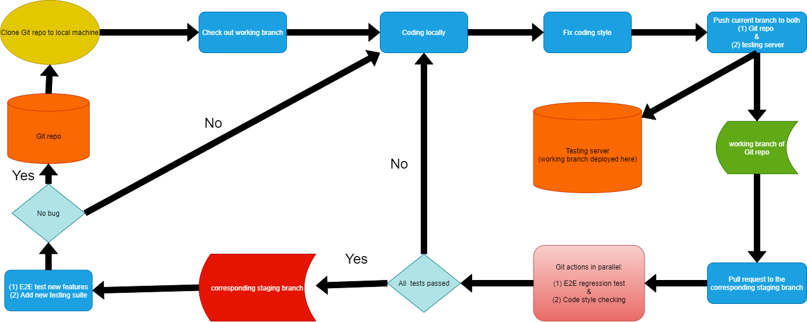

# Currently functional
1. Code style checking & fixing via prettier   
(available in VSCode IDE & Git Action on push to the staging branch)
3. E2E test via puppeteer and jest   
(available in VSCode IDE & Git Action on push to staging branch) 
5. Auto deployment to self-hosting server via Git Hook  
(available in VSCode IDE)  
# In progress
1. Linting & Code quality tool
3. Updating E2E testing code based on the UI variation
4. Unit testing (backend functions)
# Workflow flowchart

# Workflow instruction  
First, manually create new [BRANCH] from [staging] branch on https://github.com/cse110-fa21-group8/cse110-fa21-group8 as needed  
- **_Important_** :  
  - Make sure you ALWAYS create a new branch from the [staging] branch  
  - Starting from staging branch can guarantee you have the latest embedded components for Git Actions auto testing)  
## 0. Clone repo locally, and check out the [BRANCH] you are working with  
- Run : **git remote add product ssh://root@tianyuezhang1997.site/var/repo/cse110-fa21-group8.git**    
  (This command will hook your branch to the remote server so that it can be deployed later by running git push product)  
- Run: **git remote -v**    
 (This command can help you to make sure that your local repo has been hooked up to both "origin" & "product" remote repo)  
## 1. Before committing, you should fix your coding style 
- Run : **npx prettier --write .**  
- **_Note_**:  
  - This command to auto fix coding style  
  - However, prettier would NOT work if you didn't create a new [BRANCH] from [staging] branch in the very beginning  
## 2. In the terminal of your local version of [BRANCH] run the following 2 commands in any order you like, but make sure ALWAYS do BOTH  
- Run : **git push origin**  
  (origin refers to https://github.com/cse110-fa21-group8/cse110-fa21-group8)  
- Run : **git push product**  
  (product refers to the git repo on the testing server)  
- password : **[see in our project-talk Slack channel]**
- **_Note_** :  
  - If you encountered an error suggesting you run "git pull ...", that means your local version is behind  
  - (this would be due to your teammates having pushed something from their local version to the remote repo)  
  - In this case, you need to run "git pull ..". and resolve any conflicts  
## 3. Manually make a pull request from [BRANCH] to [BRANCH-staging]  
- **_Note_** :  
  - On pull request, Git Action will run auto testing on the [BRANCH] you just published  
## 4. Check the testing result of your pull request  
- **_Note for testers only_** :  
  - Testers who view the "pull request from [BRANCH] to [BRANCH-staging]"  
  - should go to https://testing.tianyuezhang1997.site/cse110-fa21-group8/[BRANCH] and locate where the index.html file is  
  - (since that is where the auto testing will begin with)  
  - Auto testing may be failed due to index.html is not located at the expected place,  
  - If that happened, the testing team should fix that URL in the testing code as soon as possible.  
  - Then, the Git Action testing on pull requests would pass if no other errors were introduced  
